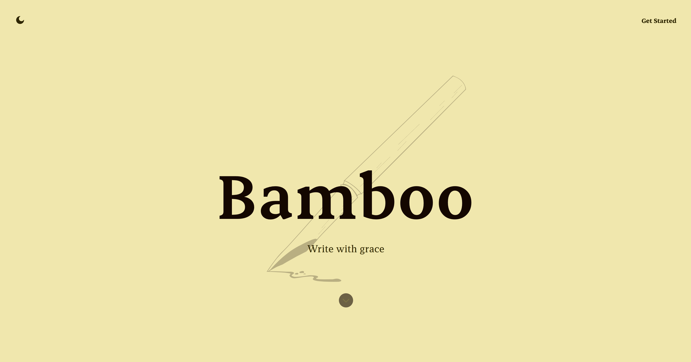

# Bamboo

*Write with grace*

A modern, elegant note-taking application built with flexibility and simplicity in mind. Like bamboo, it's designed to be strong yet flexible, adapting to your writing needs.

## ✨ Features

- **Rich Editor** - Full-featured editor with formatting, tables, and media support
- **Login & Access** - Sign in to see all your notes across any device
- **Share Anywhere** - Export as PDF or Markdown. Flexible like bamboo
- **Folder View** - Organize like Windows Explorer. Drag, drop, and nest your notes in folders
- **Dark & Light Mode** - Switch themes instantly. Easy on your eyes, day or night

## 🛠️ Tech Stack

**Frontend**
- React 19 with TypeScript
- Vite for development and building
- Custom CSS with theme switching
- SVG icons with React integration

**Backend**
- Node.js with Express
- TypeScript
- PostgreSQL database
- JWT authentication
- bcrypt for password hashing

## 🚧 Development Status

This project is currently in active development. Setup instructions and deployment guides will be added as the project progresses.

## 🎨 Design Philosophy

Bamboo embraces simplicity and elegance. The interface is clean and distraction-free, allowing you to focus on what matters most - your writing. The dual-theme support ensures comfortable writing in any lighting condition.

---

*More documentation coming soon as we continue building this project.*